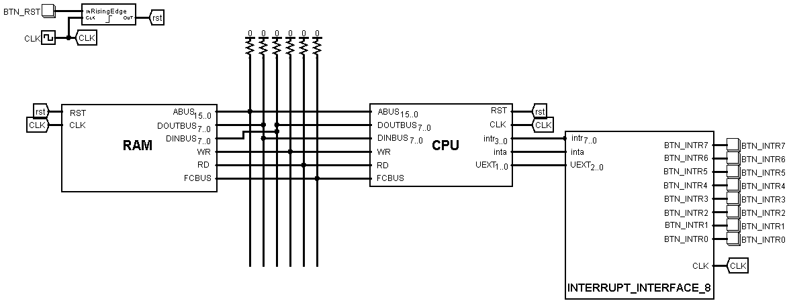
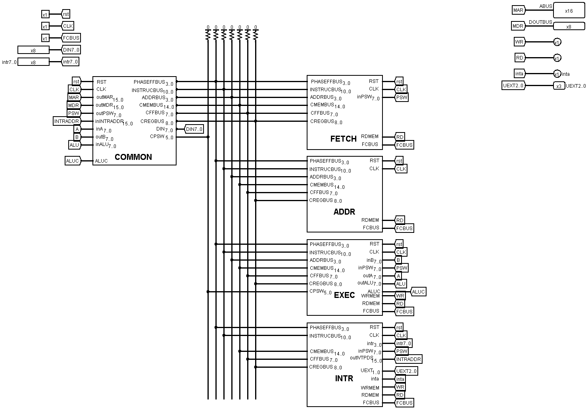
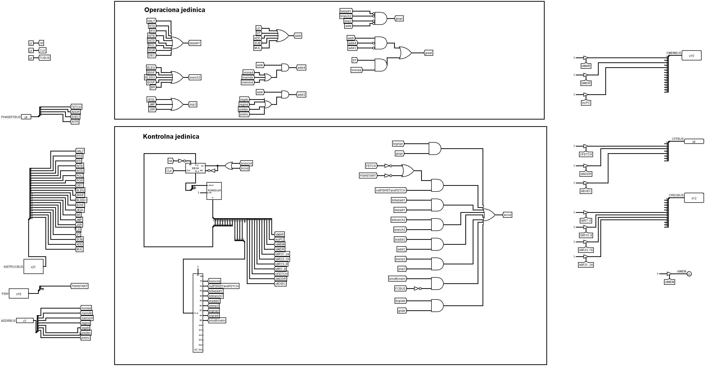
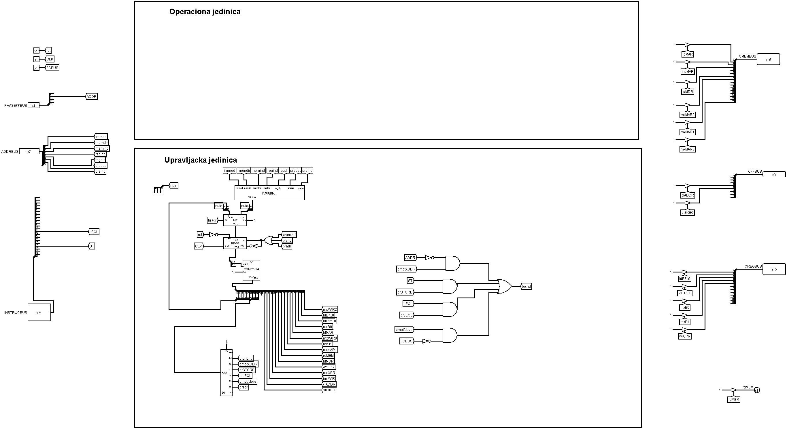
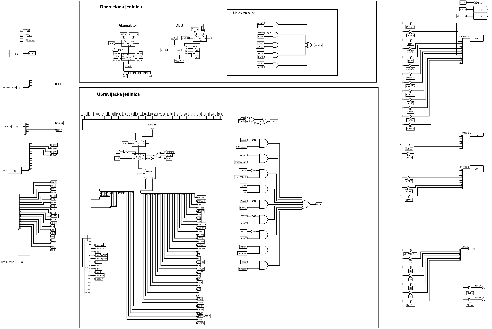
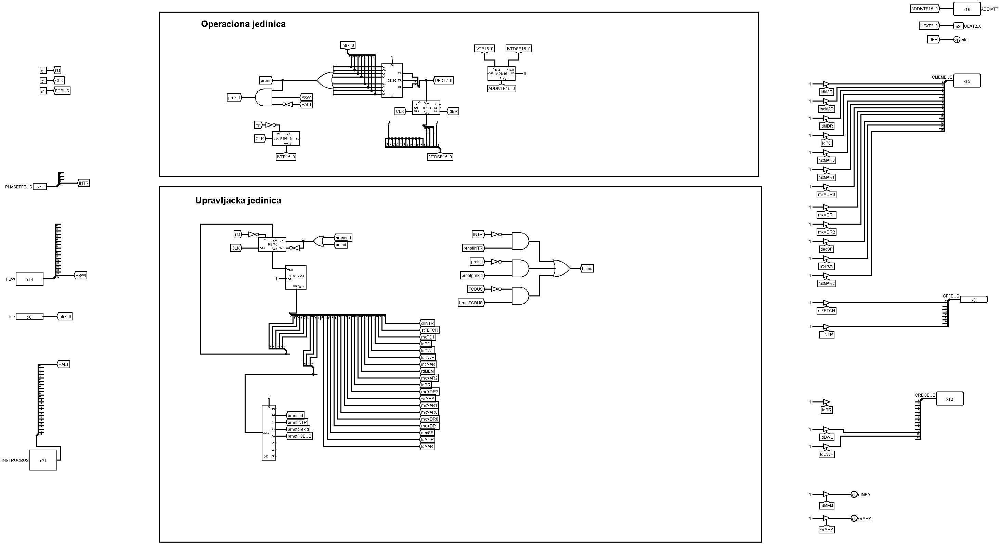

# 8bit-computer
[Computer Engineering] Programmable 8-bit computer based on von Neumann architecture, designed and implemented from scratch in Logisim.

Homework/project in **Fundamentals of Computer Engineering 2 (13E112ORT2)** at the University of Belgrade, School of Electrical Engineering.

## Computer System

A computer that consists of memory and processor is considered. The memory capacity is 2<sup>16</sup> bytes, and the memory word size is 1 byte. The processor has a single-address instruction format. Addresses occupy two adjacent memory address locations using BE (big-endian) format.



The computer uses a 4-phase instruction cycle (Fetch Instruction - Decode Instruction - Execute Instruction - Interrup Service).



### 1st Instruction Cycle Phase: FETCH

In this phase, the processor fetches the instruction from memory.



The control signal sequence for this phase can be found below. The flow diagram is also available at `CPU instruction cycle/1 - FETCH.pdf`, and `ROM/ROM_FETCH` contains the Read-Only memory for this block.
```
Step00	br(if notPSWSTandFETCH then step00)
Step01	ldMAR, incPC
Step02	ldMDR, rdMEM, br(if not FCBUS then step02)
Step03	ldIR31..24
Step04	br(if gropr then step00)
Step05	br(if bezadr1 then step12)
Step06	ldMAR, incPC
Step07	ldMDR, rdMEM, br(if not FCBUS then step07)
Step08	ldIR23..16 , br(if branch2 then step12)
Step09	br(if gradr then step00)
Step0A	br(if adr2 then step11)
Step0B	ldMAR, incPC
Step0C	ldMDR, rdMEM, br(if not FCBUS then step0C)
Step0D	ldIR15..8, br(if jmp3 then step12)
Step0E	ldMAR, incPC
Step0F	ldMDR, rdMEM, br(if not FCBUS then step0F)
Step10	ldIR7..0
Step11	clFETCH, stADDR, br step00
Step12	clFETCH,stEXEC, br step00
```

### 2nd Instruction Cycle Phase: ADDR

In this phase, the processor decodes the instruction.



The control signal sequence for this phase can be found below. The flow diagram is also available at `CPU instruction cycle/2 - ADDR.pdf`, and `ROM/ROM_ADDR` contains the Read-Only memory for this block.
```
Step00	br(if notADDR then step00)
Step01	br(case(immed, memdir, memind, regind, regdir, predec, preinc) then (immed, step02), (memdir, step05), (memind, step06), (regind, step0B), (regdir, step0C), (predec, step0F), (preinc, step13)
Step02	br(if ST then step1E)
Step03	br(if JEQL then step1E)
Step04	ldB, mxB0, br step1E
Step05	ldMAR, mxMAR0, br step18
Step06	ldMAR, mxMAR0
Step07	ldMDR, rdMEM, br(if not FCBUS then step07)
Step08	ldB15..8, incMAR
Step09	ldMDR, rdMEM, br(if not FCBUS then step09)
Step0A	ldB7..0
Step0B	ldMAR, mxMAR1, br step18
Step0C	ldMAR, mxMAR2, br step18
Step0D	br(if ST then step1E)
Step0E	br(if JEQL then step1E)
Step0F	ldB, mxB1, br step1E
Step10	ldB, mxB1
Step11	decB
Step12	wrGPR, mxGPR
Step13	ldMAR, mxMAR1, br step18
Step14	ldB, mxB1 (R[IR19..16]15..0)
Step15	incB
Step16	wrGPR, mxGPR
Step17	ldMAR, mxMAR1
Step18	br(if ST then step1E)
Step19	br(if JEQL then step1E)
Step1A	ldMDR, rdMEM, br(if not FCBUS then step1A)
Step1B	ldB15..8, incMAR
Step1C	ldMDR, rdMEM, br(if not FCBUS then step1C)
Step1D	ldB7..0
Step1E	clADDR, stEXEC, br step00
```

### 3rd Instruction Cycle Phase: EXEC

In this phase, the processor executes the instruction.



The control signal sequence for this phase can be found below. The flow diagram is also available at `CPU instruction cycle/3 - EXEC.pdf`, and `ROM/ROM_EXEC` contains the Read-Only memory for this block.
```
Step00	br(if notEXEC then step00)
Step01	br(case(HALT, RTI, RTS, INTE, INTD, ROL, ROR, DEC, BLEQ, BNVF, BLSSU, BOVF, JEQL, BR, JMP, JSR, LD, ST, SUB, ADD, MUL))
Step02	clPSWSTART, br step37
Step03	decSP
Step04	ldMAR, decSP, mxMAR0, mxMAR1
Step05	ldMDR, rdMEM, br(if notFCBUS then step05)
Step06	ldDWL, ldMAR, mxMAR0, mxMAR1
Step07	ldMDR, rdMEM, br(if notFCBUS then Step 07)
Step08	ldDWH
Step09	ldPC, mxPC1, br step37
Step0A	decSP
Step0B	ldMAR, mxMAR0, mxMAR1
Step0C	ldMDR, rdMEM, br(if notFCBUS then step 0C)
Step0D	ldN, ldV, ldZ, ldC, ldI, ldSTART, br step03
Step0E	stI, br step37
Step0F	clI, br step37
Step10	slA
Step11	ldN, ldZ, br step37
Step12	srA
Step13	ldN, ldZ, br step37
Step14	sub, mxALU, ldA, ldC, ldV
Step15	ldN, ldZ, br step37
Step16	br(if notsignal1 then step37)
Step17	ldPC, mxPC0, br step37
Step18	br(if V then step37)
Step19	ldPC, mxPC0, br step37
Step1A	br(if notC then step37)
Step1B	ldPC, mxPC0, br step37
Step1C	br(if notV then step37)
Step1D	ldPC, mxPC0, br step37
Step1E	br(if notZ then step37)
Step1F	ldPC, br step37
Step20	ldPC, mxPC0, br step37
Step21	ldPC, br step37
Step22	ldMAR, mxMAR1, mxMAR0, ldMDR, mxMDR1, incSP
Step23	wrMEM, br(if notFCBUS then step23)
Step24	ldMAR, mxMAR1, mxMAR0, ldMDR, mxMDR1, mxMDR0, incSP
Step25	wrMEM, br(if notFCBUS then step25)
Step26	ldPC, br step37
Step27	ldA
Step28	ldN, ldZ, br step37
Step29	br(if immed then step37)
Step2A	br(if regdir then step30)
Step2B	ldMDR, mxMDR2, mxMDR0
Step2C	wrMEM, br(if notFCBUS then step2C)
Step2D	incMAR, ldMDR, mxMDR0
Step2E	wrMEM, br(if notFCBUS then step2E)
Step2F	br step37
Step30	wrGPR, br step37
Step31	ldA, mxA0, sub, ldV, ldC
Step32	ldN, ldZ, br step37
Step33	ldA, mxA0, add, ldV, ldC
Step34	ldN, ldZ, br step37
Step35	ldA, mxA0, mul, ldV, ldC
Step36	ldN, ldZ
Step37	clEXEC, stINTR, br step00
```

### 4th Instruction Cycle Phase: INTR

In this phase, the processor performs interrupt service.



The control signal sequence for this phase can be found below. The flow diagram is also available at `CPU instruction cycle/4 - INTR.pdf`, and `ROM/ROM_INTR` contains the Read-Only memory for this block.
```
Step00	br(if notINTR then step00)
Step01	br(if notprekid then step11)
Step02	ldMAR, mxMAR1, mxMAR0, incSP, ldMDR, mxMDR1
Step03	wrMEM, br(if notFCBUS then step03)
Step04	ldMAR, mxMAR1, mxMAR0, incSP, ldMDR, mxMDR1, mxMDR0
Step05	wrMEM, br(if notFCBUS then step05)
Step06	ldMAR, mxMAR1, mxMAR0, incSP, ldMDR, mxMDR2, mxMDR1
Step07	wrMEM, br(if notFCBUS then step07)
Step08	ldMAR, mxMAR0, mxMAR1, ldMDR, mxMDR2, incSP
Step09	wrMEM, br(if notFCBUS then step09)
Step0A	ldBR
Step0B	ldMAR, mxMAR2, mxMAR0
Step0C	ldMDR, rdMEM, br(if notFCBUS then step0C)
Step0D	incMAR, ldDWH
Step0E	ldMDR, rdMEM, br(if notFCBUS then step0E)
Step0F	ldDWL
Step10	ldPC, mxPC1
Step11	clINTR, stFETCH, br step00
```
